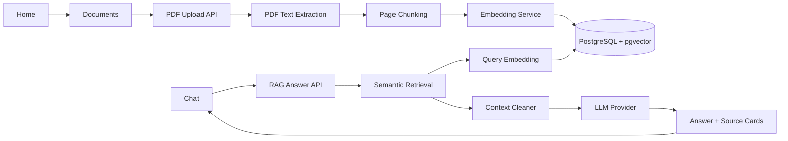

# Clinical RAG Assistant

Portfolio-ready HealthTech AI SaaS demo for uploading synthetic clinical guideline PDFs, embedding document chunks with pgvector, asking grounded questions, and reviewing source cards.

> **Safety disclaimer:** Demo only. Not for medical use. This is not a medical device, diagnostic system, triage tool, or treatment recommendation engine. Do not upload real patient data.

## Portfolio Pitch

Clinical RAG Assistant demonstrates the core workflow behind a responsible clinical knowledge assistant: ingest a safe guideline PDF, split it into auditable chunks, retrieve relevant evidence with vector search, and generate a concise answer that shows exactly which sources were used.

The app is intentionally scoped as a portfolio/demo SaaS MVP. It focuses on document-grounded answers, transparent citations, deterministic offline demos, and a clean path to OpenAI-backed retrieval and generation.

## Features

- Home page that explains the product and demo flow
- Documents page for PDF upload, document status, chunk inspection, embeddings, semantic search, and debug-style document Q&A
- Chat page as the main end-user RAG interface
- PDF extraction with page metadata
- Page-scoped chunking and PostgreSQL persistence
- Alembic-managed schema migrations
- pgvector embeddings and semantic retrieval
- RAG answers with source cards
- Deterministic demo mode with no external API calls
- OpenAI mode for realistic embeddings and answer generation
- Visible demo-only medical safety disclaimer

## Tech Stack

- **Frontend:** Vue 3, TypeScript, Vite, Tailwind CSS, Pinia
- **Backend:** FastAPI, Python 3.12, SQLAlchemy async, Alembic
- **Database:** PostgreSQL 16 with pgvector
- **AI:** deterministic local providers or OpenAI-compatible providers
- **Local infra:** Docker Compose
- **Quality:** pytest, ruff, vue-tsc, Vite production build

## Architecture



## RAG Pipeline

1. Upload a synthetic guideline PDF.
2. Validate the upload and store it as runtime data.
3. Extract text per page with `pypdf`.
4. Split page text into stable chunks while preserving page numbers.
5. Persist document and chunk metadata in PostgreSQL.
6. Generate embeddings and store them as pgvector vectors.
7. Embed the user question with the same provider family.
8. Retrieve nearest ready, embedded chunks with cosine distance.
9. Clean and deduplicate context before prompting.
10. Generate an answer from retrieved context only.
11. Return the answer, retrieval metadata, and source cards.

## Screenshots

Screenshot assets:

### Home page


### Documents upload and processing


### Document ready with embeddings


### Chat answer with sources


See `docs/screenshots.md` for the exact capture flow.

## Demo Flow

1. Start the app:

   ```bash
   docker compose up --build -d
   ```

2. Open `http://localhost:5173/`.
3. Go to Documents.
4. Upload `demo-data/synthetic-clinical-guideline.pdf`.
5. Confirm the document becomes `Ready` and embeddings become `Embedded`.
6. Go to Chat.
7. Ask: `What is the first-line management pathway for Condition G?`
8. Inspect the answer and source cards.
9. Ask: `What emergency warning signs require urgent escalation?`
10. Confirm the answer is grounded and readable.

## Example Questions

- What is the first-line management pathway for Condition G?
- What emergency warning signs require urgent escalation?
- When should follow-up happen?
- What are the contraindications for MetaboLite-A?

## Local Docker Setup

Create a local environment file:

```bash
cp .env.example .env
```

Start the app:

```bash
docker compose up --build -d
```

Open:

- Home: `http://localhost:5173`
- Documents: `http://localhost:5173/documents`
- Chat: `http://localhost:5173/chat`
- Backend API: `http://localhost:8000`
- API docs: `http://localhost:8000/docs`

Stop the app:

```bash
docker compose down
```

Reset the local database:

```bash
docker compose down -v
```

This removes the PostgreSQL Docker volume. Uploaded PDFs are runtime files under `backend/storage/uploads` and are ignored by Git.

## Deterministic Mode

Deterministic mode is the default for local demos and GitHub review:

```env
EMBEDDING_PROVIDER=deterministic
LLM_PROVIDER=deterministic
OPENAI_API_KEY=replace-me
```

This mode makes no external API calls. It is stable and useful for demos, but it is not a realistic measure of semantic retrieval quality.

## OpenAI Mode

To use OpenAI-backed embeddings and answer generation, update your local `.env`:

```env
EMBEDDING_PROVIDER=openai
LLM_PROVIDER=openai
OPENAI_API_KEY=your-openai-api-key
OPENAI_EMBEDDING_MODEL=text-embedding-3-small
OPENAI_CHAT_MODEL=gpt-4.1-mini
```

Never commit `.env` or real API keys. Automated tests use fake providers and do not call external APIs.

## Developer Commands

Direct commands:

```bash
# Start / stop / reset
docker compose up --build -d
docker compose down
docker compose down -v

# Backend
cd backend
python -m pytest
python -m ruff check src tests

# Frontend
cd frontend
npm run typecheck
npm run build
```

Makefile shortcuts:

```bash
make start-detached
make stop
make reset-db
make backend-test
make backend-lint
make frontend-typecheck
make frontend-build
make lint
```

`make lint` runs backend ruff plus frontend typecheck. No separate frontend ESLint setup is configured.

## Project Structure

```text
clinical-rag-assistant/
  backend/                  FastAPI API, services, repositories, migrations, tests
  frontend/                 Vue 3 + TypeScript app
  demo-data/                Synthetic demo guideline source and PDF
  docs/                     Architecture, demo, screenshots, safety notes
  infra/db/                 PostgreSQL initialization
  docker-compose.yml        Local app, API, and pgvector database
```

## Deployment Readiness

A production-like deployment would need:

- hosted PostgreSQL with pgvector enabled
- backend service capable of running FastAPI and Alembic migrations
- frontend static hosting for the Vite build output
- environment variables for database URL, CORS origins, provider selection, model names, upload size limits, and runtime settings
- OpenAI API key or another compatible provider credential for non-deterministic mode
- persistent file storage for uploaded PDFs instead of local container storage
- HTTPS, monitoring, logging, backup/restore, rate limits, and access controls

This repository does not include provider-specific cloud deployment code yet.

## Known Limitations

- Demo only; not clinically validated.
- No authentication, authorization, tenant isolation, or patient records.
- No OCR for scanned PDFs.
- No streaming responses.
- No BM25, hybrid search, reranking, or evaluation harness.
- No database-backed chat history.
- Uploaded files are local runtime data in the Docker setup.
- Deterministic providers are offline-demo utilities, not production AI quality.

## Future Improvements

- Authentication and role-aware access
- Multi-document filtering
- Hybrid search with BM25 and vector retrieval
- Reranking
- Background document processing jobs
- OCR for scanned PDFs
- Streamed chat responses
- Database-backed conversation history
- Retrieval and faithfulness evaluation harness
- Provider-neutral deployment templates and observability

## Repository Safety

- `.env`, backend/frontend env files, uploads, caches, builds, `node_modules`, local databases, and runtime files are ignored.
- `.env.example` contains placeholder/local-demo values only.
- The included guideline is synthetic and clearly marked as demo data.
- Do not commit real API keys, credentials, private PDFs, patient records, or generated runtime uploads.
