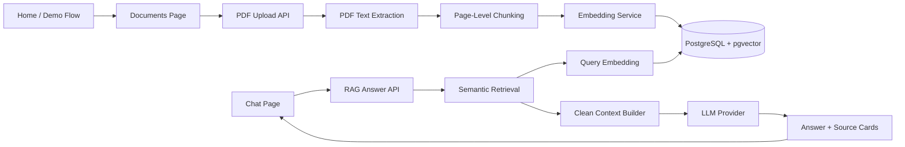

# Clinical RAG Assistant

Portfolio-ready HealthTech AI SaaS MVP for uploading clinical guideline PDFs, embedding document chunks with pgvector, asking grounded questions, and reviewing answer source cards.

> **Safety disclaimer:** Demo only. Not for medical use. This is not a medical device, diagnostic system, triage tool, or treatment recommendation engine. Do not upload real patient data.

## Short Pitch

Clinical teams need AI interfaces that can show where answers came from. This project demonstrates a source-grounded retrieval-augmented generation workflow: upload safe guideline documents, process them into searchable chunks, retrieve relevant evidence, and generate concise answers with visible sources.

The product surface is intentionally simple:

- **Home:** product overview and guided demo entry point
- **Documents:** upload PDFs, inspect processing, chunks, embeddings, and semantic search
- **Chat:** primary end-user RAG interface for questions and source-grounded answers

## Screenshots

Add screenshots before publishing the portfolio repo:

- `docs/screenshots/home.png` - Home page overview
- `docs/screenshots/documents.png` - PDF upload and knowledge-base status
- `docs/screenshots/chat-answer-sources.png` - Chat answer with source cards

Suggested capture flow:

1. Start the app with Docker Compose.
2. Upload the synthetic demo PDF.
3. Ask an example question in Chat.
4. Capture the answer and source cards.

## Why This Project Matters

This MVP focuses on the parts that matter for responsible clinical knowledge workflows:

- **Grounded AI:** answers are built from retrieved document chunks, not free-form model memory.
- **Retrieval-augmented generation:** pgvector similarity search finds relevant evidence before answer generation.
- **Source transparency:** every answer can show source cards with document name, page, chunk, similarity, and preview text.
- **Safe workflow boundaries:** the UI and prompts keep demo-only disclaimers visible and avoid patient-specific clinical advice.
- **Maintainable architecture:** document processing, embeddings, retrieval, and RAG are separated into service/repository layers.

## Tech Stack

- **Frontend:** Vue 3, TypeScript, Vite, Tailwind CSS, Pinia
- **Backend:** FastAPI, Python, SQLAlchemy async, Alembic
- **Database:** PostgreSQL with pgvector
- **AI:** OpenAI-compatible embedding and LLM provider abstractions
- **Local demo:** deterministic fake providers for stable tests and offline demos
- **Infra:** Docker Compose
- **Quality:** pytest, ruff, TypeScript typecheck, production frontend build

## Architecture



## RAG Pipeline

1. Upload a synthetic guideline PDF.
2. Validate the file and store it under runtime storage.
3. Extract text per page with `pypdf`.
4. Chunk page text while preserving page numbers.
5. Persist document and chunk metadata in PostgreSQL.
6. Generate and store pgvector embeddings for each chunk.
7. Embed the user query with the same provider family.
8. Retrieve nearest ready, embedded chunks with pgvector cosine distance.
9. Clean and deduplicate context before prompting.
10. Generate a concise answer from retrieved context only.
11. Return answer metadata and source cards.

## Current MVP Status

Implemented:

- polished Home page for portfolio/demo presentation
- PDF upload with validation
- PDF text extraction and page-level chunking
- PostgreSQL persistence for documents and chunks
- Alembic migrations
- pgvector embeddings for stored chunks
- semantic retrieval over embedded chunks
- primary Chat page using `POST /api/v1/rag/answer`
- grounded answer generation with source cards
- deterministic demo mode for tests/local review
- OpenAI mode for real embeddings and answer generation

Not implemented:

- authentication or roles
- patient records
- OCR for scanned PDFs
- streaming responses
- BM25 or hybrid search
- advanced reranking
- database conversation history
- production deployment hardening

## Setup

```bash
cp .env.example .env
docker compose up --build
```

App URLs:

- Home: http://localhost:5173
- Chat: http://localhost:5173/chat
- Documents: http://localhost:5173/documents
- Backend API: http://localhost:8000
- API docs: http://localhost:8000/docs

## Environment Variables

Key settings in `.env`:

```env
DATABASE_URL=postgresql+asyncpg://clinical_app:clinical_app_password@db:5432/clinical_rag
EMBEDDING_PROVIDER=deterministic
LLM_PROVIDER=deterministic
OPENAI_API_KEY=replace-me
OPENAI_EMBEDDING_MODEL=text-embedding-3-small
OPENAI_CHAT_MODEL=gpt-4.1-mini
MAX_UPLOAD_MB=10
VITE_API_BASE_URL=http://localhost:8000/api/v1
```

## Deterministic Demo Mode

Use deterministic providers for local demos, tests, and GitHub reviewers:

```env
EMBEDDING_PROVIDER=deterministic
LLM_PROVIDER=deterministic
OPENAI_API_KEY=replace-me
```

This mode makes no external API calls. It is stable and useful for demonstration, but it does not represent real semantic quality.

## OpenAI Mode

Use OpenAI-compatible providers for realistic embeddings and answer generation:

```env
EMBEDDING_PROVIDER=openai
LLM_PROVIDER=openai
OPENAI_API_KEY=your-key
OPENAI_EMBEDDING_MODEL=text-embedding-3-small
OPENAI_CHAT_MODEL=gpt-4.1-mini
```

Automated tests use fake providers and do not call external APIs.

## Database Migrations

Alembic owns the database schema. The FastAPI app does not call `create_all`.

Run migrations locally from the backend folder:

```bash
cd backend
alembic upgrade head
```

Docker Compose runs migrations before starting the backend:

```bash
docker compose up --build
```

Reset local development data:

```bash
docker compose down -v
```

This removes the PostgreSQL volume. Runtime uploads under `backend/storage/uploads` can be cleared separately.

## Demo Data

A safe synthetic guideline is included:

- `demo-data/sample-clinical-guideline.md`

Export or print it to PDF before uploading. Do not upload real patient data.

Example questions:

- What is the first-line management pathway for Condition G?
- What emergency warning signs require urgent escalation?
- When should follow-up happen?
- What are the contraindications for MetaboLite-A?

## Demo Flow

1. Start Docker:

   ```bash
   docker compose up --build
   ```

2. Open http://localhost:5173.
3. Go to Documents.
4. Upload a synthetic guideline PDF.
5. Confirm the document becomes `Ready` and embeddings become `Embedded`.
6. Go to Chat.
7. Ask: `What is the first-line management pathway for Condition G?`
8. Inspect the answer and source cards.
9. Ask: `What emergency warning signs require urgent escalation?`
10. Confirm the answer is grounded and readable.

## API Highlights

Upload:

```http
POST /api/v1/documents/upload
```

List documents:

```http
GET /api/v1/documents
```

Semantic retrieval:

```http
POST /api/v1/retrieval/search
```

Grounded answer generation:

```http
POST /api/v1/rag/answer
```

## Tests

Backend:

```bash
cd backend
python -m pytest
python -m ruff check src tests
```

Frontend:

```bash
cd frontend
npm run typecheck
npm run build
```

## Known Limitations

- Scanned PDFs are not supported because OCR is out of scope.
- Deterministic providers are demo-only and not semantically meaningful.
- Answers depend on retrieval quality and uploaded document content.
- There is no authentication, authorization, tenant isolation, or audit-grade access control.
- There is no clinical validation, monitoring, or production deployment hardening.
- This project must not be used with real patient data.

## Future Improvements

- Authentication and role-aware access
- Multi-document filtering
- Hybrid search with BM25 and vector retrieval
- Reranking
- Background document processing jobs
- OCR for scanned PDFs
- Streamed chat responses
- Database-backed conversation history
- Evaluation harness for retrieval and answer faithfulness
- Deployment configuration and observability
